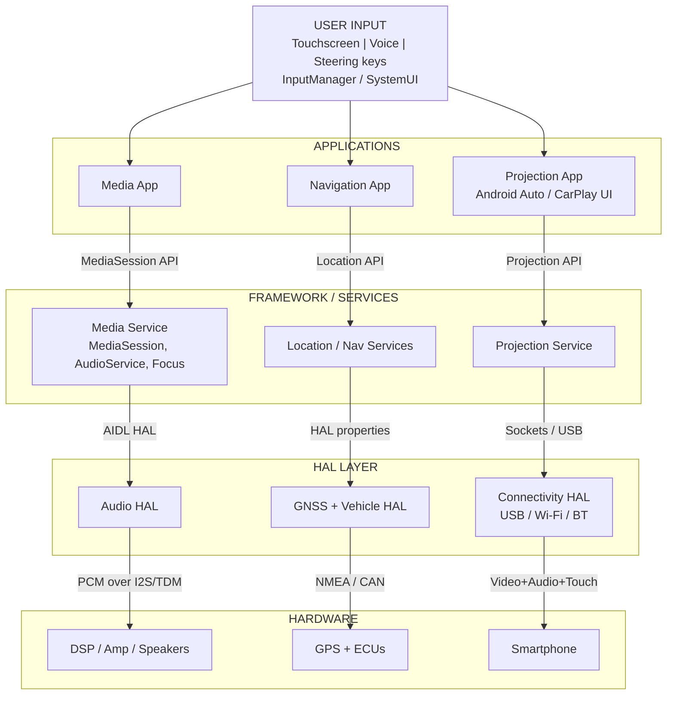

# IVI Conceptual Architecture: Media, Navigation & Projection

A conceptual architecture for an **In-Vehicle Infotainment (IVI)** system that integrates media playback, turn-by-turn navigation and smartphone projection (Android Auto / CarPlay style). The design follows a five-layer model inspired by **Android Automotive OS** and annotates the interface at every component boundary.

> Course assignment: *IVI In-Vehicle Infotainment Systems, Question 1: design a conceptual architecture diagram integrating media, navigation and projection features. Annotate component interfaces and data flow.*

---

## Contents

- [Overview](#overview)
- [Architecture](#architecture)
- [Interfaces](#interfaces)
- [Data flow scenarios](#data-flow-scenarios)
- [Audio focus rules](#audio-focus-rules)
- [Repository structure](#repository-structure)
- [How to view](#how-to-view)
- [Limitations and future work](#limitations-and-future-work)
- [Author](#author)

## Overview

| Item | Details |
|------|---------|
| Domain | Automotive infotainment |
| Features covered | Media, Navigation, Phone projection |
| Reference model | Android Automotive OS concepts |
| Deliverables | Architecture diagram (HTML/SVG), detailed project report (PDF), this README |

## Architecture

Requests flow **down** (user to hardware); sensor and media data flow **up**. Each feature is a vertical column that crosses all layers, which isolates faults between features.



## Interfaces

| Boundary | Interface / Protocol | Data |
|----------|---------------------|------|
| Input to Apps | InputManager events | Touch, keys, voice intents |
| Media App to Media Service | MediaSession API (Binder) | Transport commands, metadata, state |
| Nav App to Location Service | Location API (Binder/AIDL) | Fixes, speed, heading |
| Projection App to Projection Service | Projection API (Binder) | UI events, frames, touch relay |
| Media Service to Audio HAL | AIDL/HIDL HAL | Audio streams, routing, volume groups |
| Location Service to GNSS/Vehicle HAL | HAL properties | Position, speed, gear |
| Projection Service to Connectivity HAL | Sockets / USB bulk | Video, audio, touch streams |
| Audio HAL to DSP/Amp | I2S / TDM / A2B | PCM samples |
| GNSS/Vehicle HAL to GPS/ECU | UART (NMEA) / CAN | Sentences, signal frames |

## Data flow scenarios

**A. User plays a song**
1. Touch event reaches the Media App via InputManager.
2. Media App calls `play()` on the MediaSession and requests audio focus.
3. Media Service routes the stream to the Audio HAL (media volume group).
4. PCM data goes over I2S/TDM to the DSP, amplifier and speakers.

**B. Navigation guidance**
1. GPS (NMEA over UART) and ECU (CAN) data reach the GNSS/Vehicle HAL.
2. Location Service fuses them and publishes location updates.
3. Navigation App updates the map and computes the next maneuver.
4. The voice prompt plays with transient focus; media is ducked.

**C. Phone projection**
1. Phone connects over USB/Wi-Fi to the Connectivity HAL.
2. Projection Service opens video, audio and control channels.
3. Frames render on the head-unit display; touch is relayed back to the phone.
4. Phone audio is mixed through the car audio system.

## Audio focus rules

| Event | Effect on current audio | After event |
|-------|------------------------|-------------|
| Navigation prompt | Media ducked | Media returns to full volume |
| Incoming call | Media and nav prompts paused/muted | Media resumes automatically |
| Projected app audio | Local media paused | User may resume local media |
| Voice assistant | Media ducked or paused | Media restored |

Priority (high to low): safety alerts, phone call, navigation prompt, voice assistant, media.

## Repository structure

```
ivi-architecture/
├── README.md
├── docs/
│   └── IVI_Project_Report.pdf      # Detailed project report
└── diagram/
    └── ivi_architecture.html       # Annotated architecture diagram (open in browser)
```

## How to view

- **Report:** open `docs/IVI_Project_Report.pdf`.
- **Diagram:** open `diagram/ivi_architecture.html` in any browser (supports light and dark mode).
- **Inline diagram:** the Mermaid chart above renders automatically on GitHub.

## Limitations and future work

- Conceptual design only; no implementation or measurements.
- Security and functional safety (ISO 26262) are not analysed in detail.
- Planned: media app prototype on the Android Automotive emulator with logcat analysis of audio focus, multi-zone audio, and UML/Simulink interruption models.

## References

- Android Open Source Project: Android Automotive OS documentation (source.android.com/docs/automotive)
- Android Developers: Audio focus and Media session guides
- Android Developers: Android for Cars (Android Auto and Car App Library)

## Author

**[Your Name]**, [Course / Department], [College Name]
Guide: [Faculty Name]
